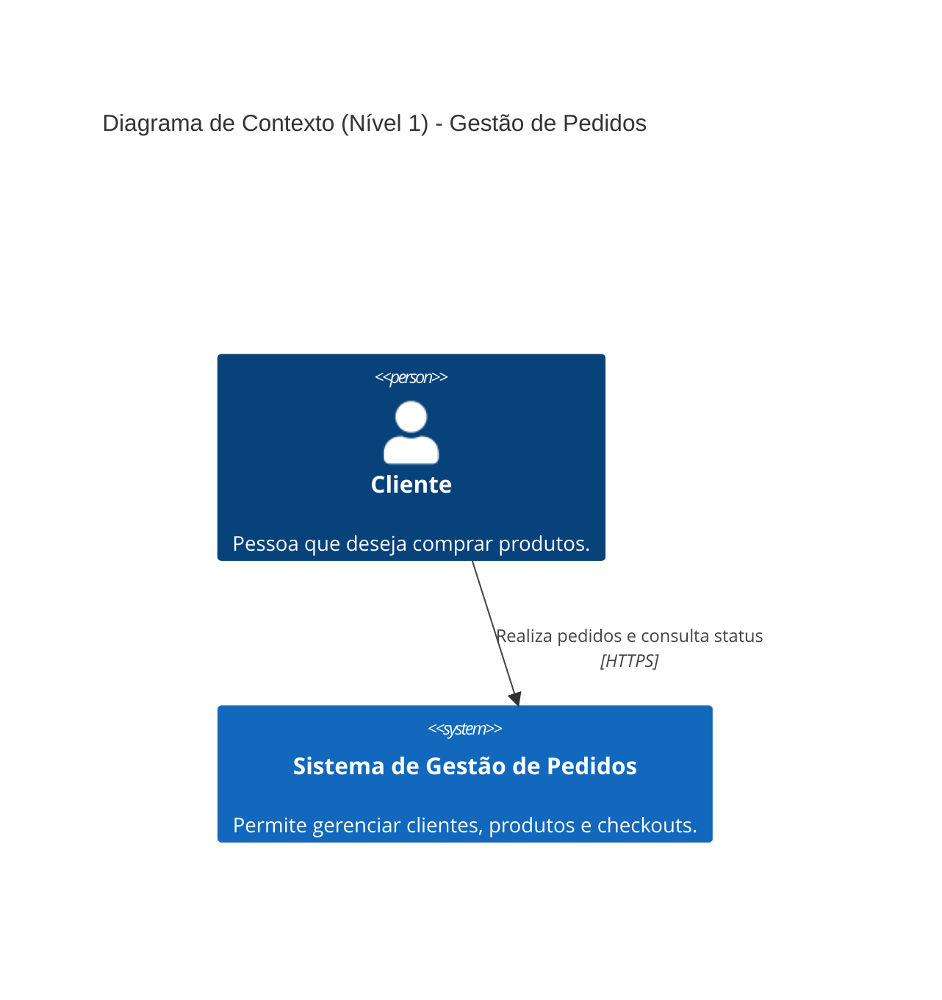
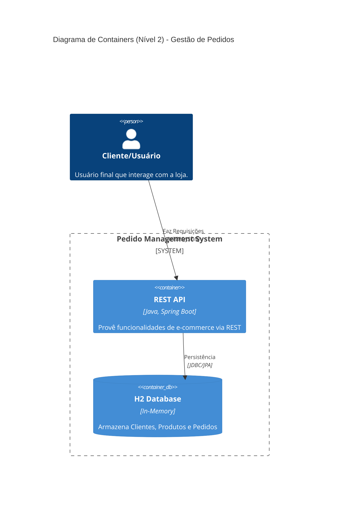
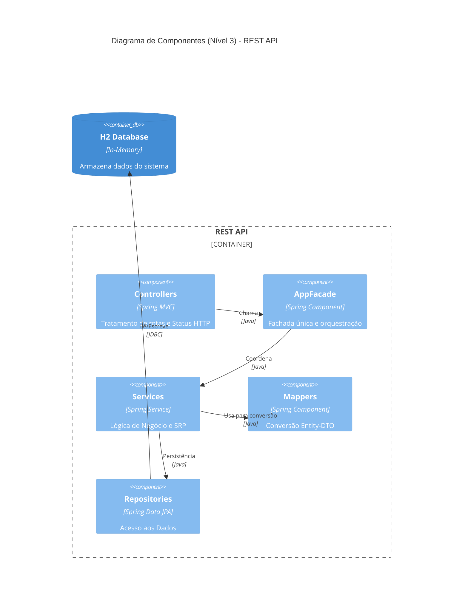

# ProjetoPosXP - API de Gestão de Pedidos


Este projeto é uma API RESTful desenvolvida para o gerenciamento de um domínio de **E-commerce**, abrangendo as entidades de **Clientes**, **Produtos** e **Pedidos**. A aplicação segue padrões arquiteturais modernos e princípios de código limpo (SOLID).

## 🚀 Tecnologias Utilizadas

- **Java 21**: Utilização de recursos modernos como Records para DTOs.
- **Spring Boot 4.0.5**: Framework base para a aplicação.
- **Spring Data JPA**: Abstração da camada de persistência.
- **H2 Database**: Banco de dados em memória.
- **Lombok**: Redução de código boilerplate.
- **SpringDoc OpenAPI (Swagger)**: Documentação interativa da API.
- **Spring Events**: Implementação do padrão de projeto **Observer**.
- **Mermaid.js**: Utilizado para documentação de arquitetura via código.

## 🏗️ Arquitetura (C4 Model)

O sistema é documentado utilizando o modelo C4 para diferentes níveis de abstração:

### Nível 1: Diagrama de Contexto
Visão macro do sistema e seus usuários.



### Nível 2: Diagrama de Containers
Visão dos grandes blocos que compõem o sistema.



### Nível 3: Diagrama de Componentes
Detalhamento interno da API e os padrões aplicados.



## 📂 Estrutura de Arquivos e Padrões Implementados

Abaixo, a estrutura do projeto indicando onde cada padrão de projeto e princípio SOLID foi aplicado:

```text
src/main/java/API/ProjetoPosXP/
├── controller/         <-- [Camada Web] Mapeamento de rotas e Status HTTP
├── facade/             <-- [Padrão Facade] AppFacade: Ponto de entrada único para controllers
├── service/            <-- [Camada Service] Regras de negócio e lógica de domínio
├── repository/         <-- [Camada Persistence] Interfaces Spring Data JPA
├── model/              <-- [Camada Domain] Entidades JPA e Agregados
├── dto/                <-- [DTO Pattern] Records para transferência segura de dados
├── mapper/             <-- [Padrão Mapper] Conversão entre Entidades e DTOs (SRP)
├── exception/          <-- [Padrão Global Exception Handler] Tratamento centralizado de erros
├── event/              <-- [Padrão Observer] Definição de eventos de sistema
└── listener/           <-- [Padrão Observer] Consumidores assíncronos de eventos
```

## 🏗️ Padrões de Projeto e Princípios SOLID

O projeto foi refatorado para garantir alta manutenibilidade e escalabilidade:

1.  **Facade Pattern**: Implementado na classe `AppFacade`. Os Controllers agora interagem apenas com esta fachada, reduzindo o acoplamento e simplificando a orquestração de serviços.
2.  **Mapper Pattern**: Classes dedicadas (`ClienteMapper`, `ProdutoMapper`, etc.) isolam a lógica de conversão entre entidades e DTOs, respeitando o Princípio de Responsabilidade Única (SRP).
3.  **Observer Pattern**: Utilização do `ApplicationEventPublisher` do Spring para notificação de status de pedidos de forma desacoplada.
4.  **Global Exception Handler**: Uso de `@RestControllerAdvice` para capturar exceções de negócio (`BusinessException`, `ResourceNotFoundException`) e padronizar as respostas de erro da API.
5.  **Simplified Controllers**: Controllers limpos que retornam DTOs diretamente, delegando o status HTTP para o `AppFacade` e `@ResponseStatus`.

## 🛠️ Como Executar

1.  Certifique-se de ter o **Java 21** e **Maven** instalados.
2.  Execute o comando:
    ```bash
    ./mvnw spring-boot:run
    ```

## 📖 Documentação da API (Swagger)

Acesse a documentação interativa em:
👉 [http://localhost:8080/swagger-ui/index.html](http://localhost:8080/swagger-ui/index.html)

### Principais Endpoints:

- `GET /api/clientes` - Lista todos os clientes.
- `GET /api/clientes/{id}/pedidos` - Consulta o histórico completo de pedidos de um cliente.
- `POST /api/produtos` - Cadastra um novo produto.
- `POST /api/pedidos` - Realiza o checkout de um pedido (baixa no estoque).
- `PATCH /api/pedidos/{id}/status` - Atualiza o status e notifica o cliente.


## ✅ Testes

Para executar a suíte de testes unitários:
```bash
./mvnw test
```

---
Desenvolvido como projeto de demonstração para a **XPEducação**.
